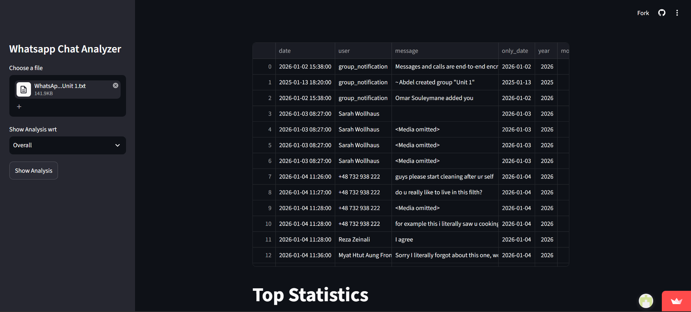
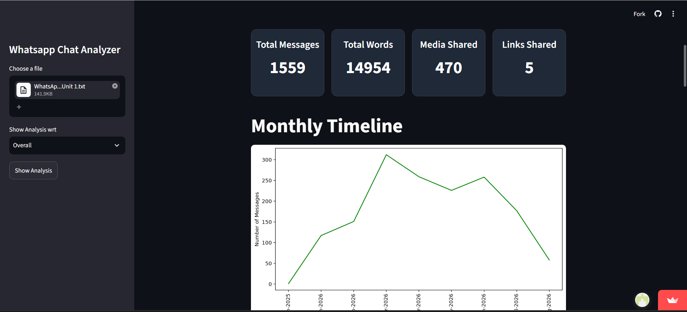
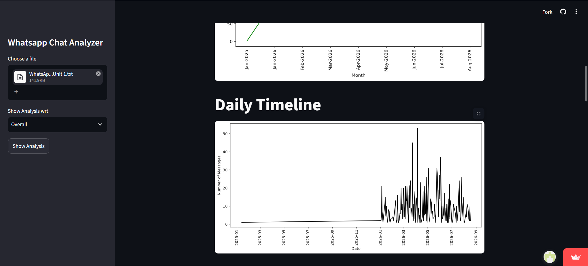
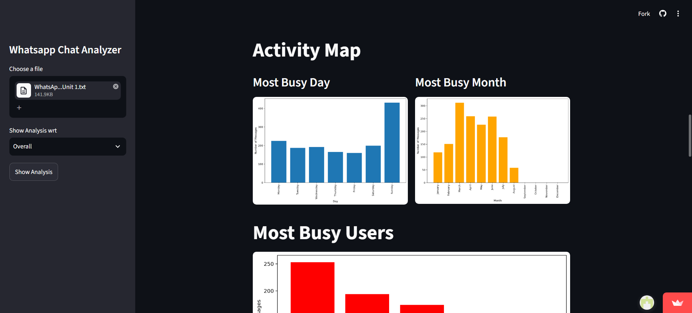
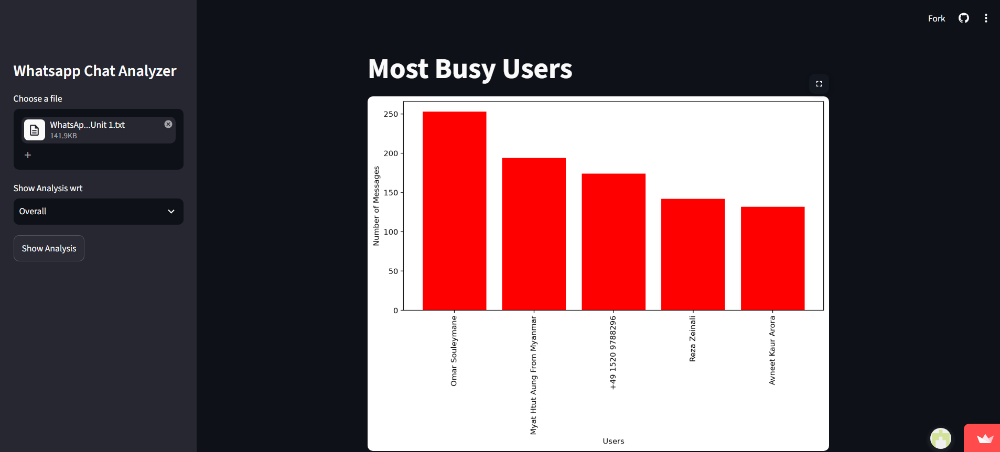
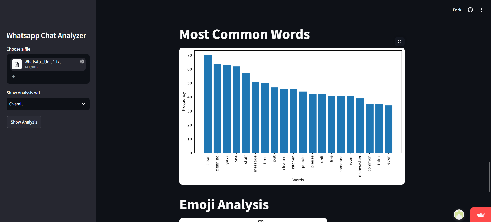
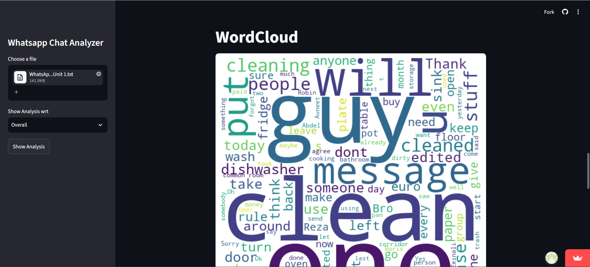
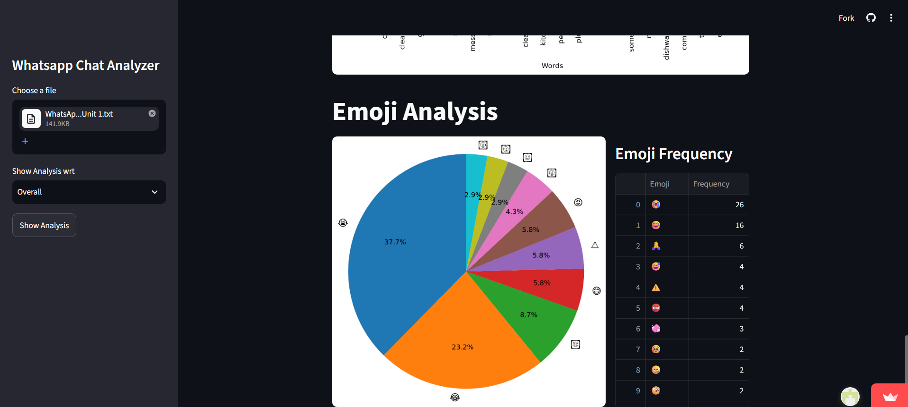

# WhatsApp Chat Analyzer


An interactive WhatsApp chat analytics dashboard built with **Python and Streamlit** that transforms exported WhatsApp conversations into meaningful communication insights through statistics, timelines, activity analysis, word frequency, WordClouds, and emoji analytics.
## 🚀 Live Demo

**Live Application:**  
[Open the WhatsApp Chat Analyzer](https://whatsapp-chat-analyzer-dev.streamlit.app/)

**GitHub Repository:**  
[View the source code on GitHub](https://github.com/DevSavaliya/Whatsapp-Chat-Analyzer)
---

## 📌 Project Overview

WhatsApp conversations contain valuable information about communication patterns, participation, activity levels, commonly used words, shared links, media, and emojis.

However, raw WhatsApp chat exports are difficult to analyze manually.

The **WhatsApp Chat Analyzer** solves this problem by converting an exported WhatsApp `.txt` chat file into an interactive analytics dashboard.

Users can upload their WhatsApp chat export, select either the complete conversation or an individual participant, and explore different aspects of the conversation through statistics and visualizations.

The application makes conversational data analysis simple, interactive, and accessible without requiring users to write code.

---

## 🎯 Project Objectives

The main objectives of this project are to:

- Convert unstructured WhatsApp chat exports into structured data.
- Build an interactive and user-friendly analytics dashboard.
- Analyze communication patterns over time.
- Identify participant engagement and activity.
- Analyze commonly used words and emojis.
- Visualize communication trends using charts.
- Provide both overall and participant-level analysis.
- Demonstrate practical Python data analysis and visualization.
- Deploy the application as an accessible web application using Streamlit Community Cloud.
- Apply software development, data processing, visualization, and deployment concepts in a real-world project.

---

## ✨ Features

### 📊 Overall Statistics

The dashboard provides key conversation statistics including:

- Total Messages
- Total Words
- Media Shared
- Links Shared

These metrics provide a quick overview of the selected conversation.

---

### 👤 User-Specific Analysis

Users can choose between:

- **Overall** — analyze the complete conversation.
- **Individual participant** — analyze messages from a specific participant.

This makes it possible to explore individual communication behavior within group or personal conversations.

---

### 📈 Monthly Timeline

The monthly timeline visualizes message activity across different months.

It helps identify:

- Highly active months
- Low-activity periods
- Long-term communication trends
- Changes in communication volume

---

### 📅 Daily Timeline

The daily timeline displays the number of messages exchanged on each date.

It can be used to identify:

- Highly active days
- Communication patterns
- Periods of increased activity
- Changes in engagement over time

---

### 🗓️ Activity Map

The application analyzes activity according to:

- Day of the week
- Month

This helps identify when the conversation is most active.

---

### 👥 Most Busy Users

For group conversations, the application identifies participants with the highest number of messages.

This provides an overview of participant engagement and communication activity.

---

### 🔤 Most Common Words

The application calculates frequently used words while filtering common stopwords.

This provides a clearer representation of important and frequently occurring conversational terms.

---

### ☁️ WordCloud

The application generates a visual WordCloud based on frequently used words.

The WordCloud provides a quick visual representation of the vocabulary and recurring themes within the conversation.

---

### 😀 Emoji Analysis

The application analyzes emoji usage and displays:

- Most frequently used emojis
- Emoji frequency
- Top 10 emojis
- Emoji distribution

This provides an additional perspective on communication style and expression.

---

### 🔗 Link Analysis

The application detects links shared within the conversation and calculates the total number of links.

---

### 📱 Media Analysis

The application detects messages containing WhatsApp media placeholders and calculates the amount of media shared.

---

## 🖥️ Application Screenshots

### 📊 Dashboard Overview

The main dashboard provides an overview of the selected WhatsApp conversation, including key statistics such as messages, words, media, and links.



---

### 📈 Monthly Timeline

Visualizes message activity across different months and helps identify long-term communication trends.



---

### 📅 Daily Timeline

Shows the number of messages exchanged on each day.



---

### 🗓️ Activity Map

Analyzes communication activity based on days of the week and months.



---

### 👥 Most Busy Users

Displays participants with the highest message activity in group conversations.



---

### 🔤 Most Common Words

Shows the most frequently used words in the selected conversation after filtering common stopwords.



---

### ☁️ WordCloud

Provides a visual representation of frequently occurring words in the conversation.



---

### 😀 Emoji Analysis

Analyzes emoji usage and displays the most frequently used emojis.



---

## 🔄 Application Workflow

The application follows the following workflow:

```text
WhatsApp Chat Export
        │
        ▼
Upload .txt File
        │
        ▼
Message Preprocessing
        │
        ▼
Date & User Extraction
        │
        ▼
Structured Pandas DataFrame
        │
        ▼
Data Analysis
        │
        ├── Message Statistics
        ├── User Activity
        ├── Monthly Timeline
        ├── Daily Timeline
        ├── Activity Analysis
        ├── Common Words
        ├── WordCloud
        └── Emoji Analysis
        │
        ▼
Interactive Streamlit Dashboard